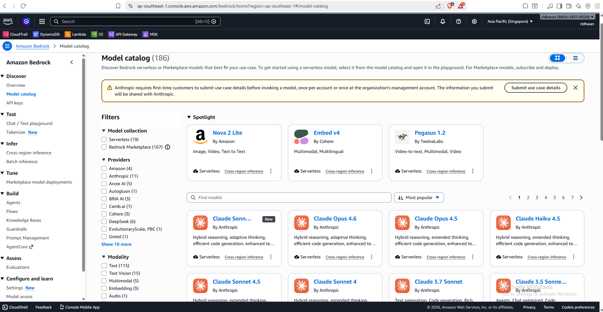
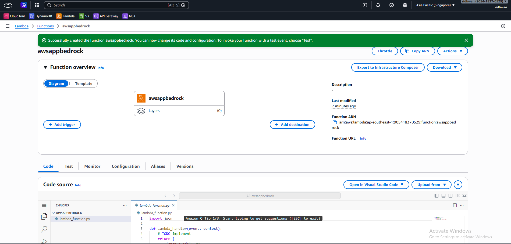
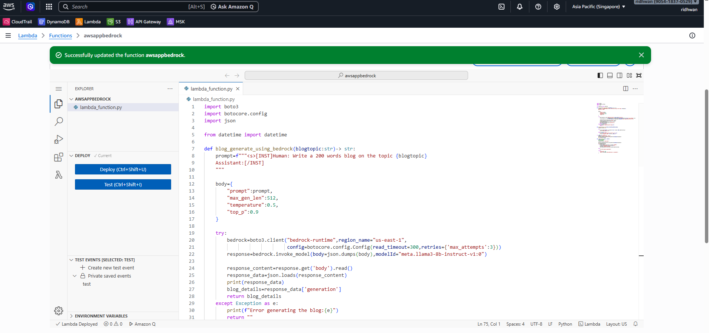
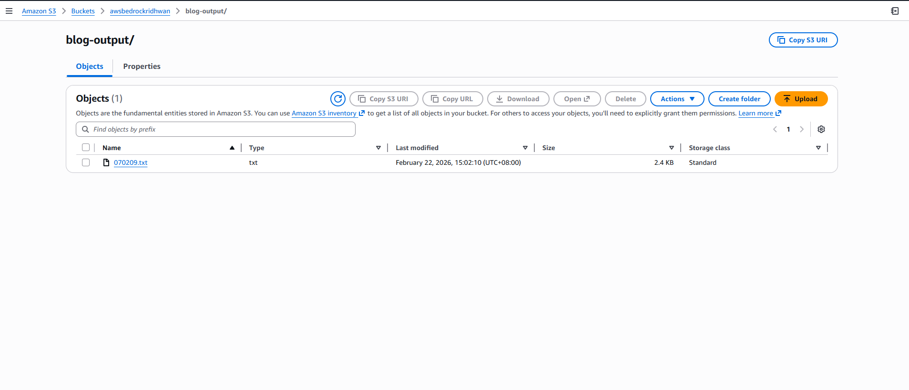
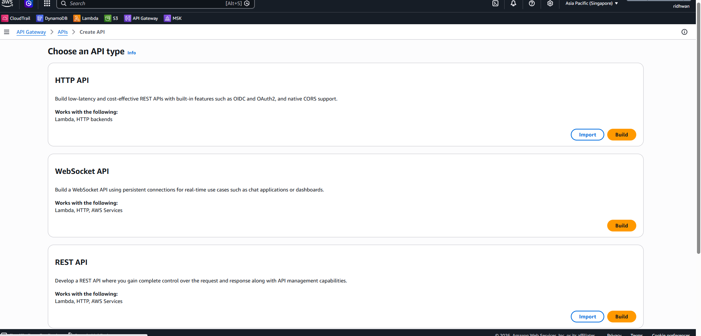
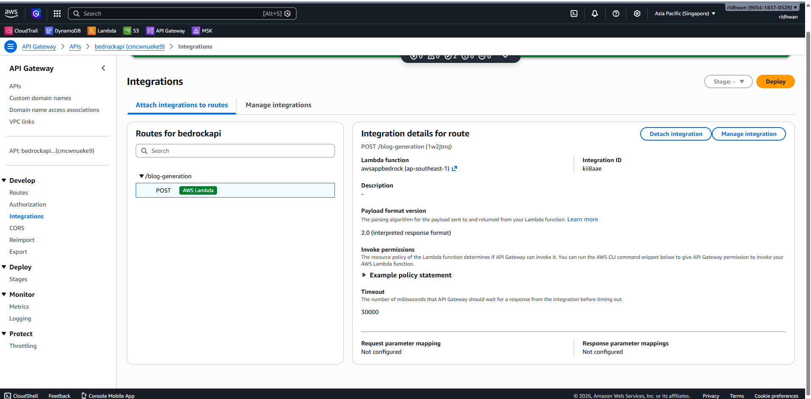
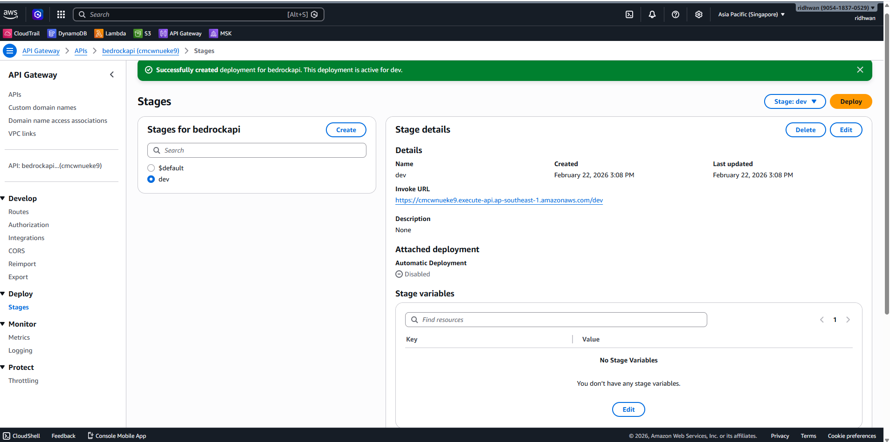
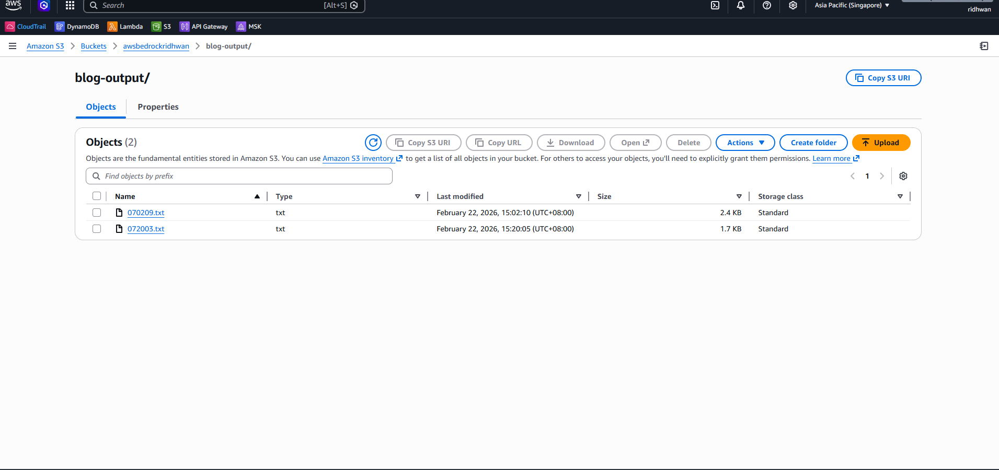

# AI Blog Generation with AWS Bedrock, Lambda & API Gateway

A serverless application that generates AI-powered blog posts using AWS Bedrock, stores them in S3, and exposes the functionality through an API Gateway endpoint.

---

## 🏗️ Architecture

```
API Gateway (HTTP API)
        ↓
AWS Lambda Function
        ↓
AWS Bedrock (Claude AI Model)
        ↓
Amazon S3 (Store Generated Content)
```

---

## 📋 Project Overview

This project demonstrates:
- **AI Model Selection**: Choose and configure models from AWS Bedrock catalog
- **Serverless Compute**: Deploy logic using AWS Lambda functions
- **API Integration**: Expose Lambda function via API Gateway HTTP API
- **Cloud Storage**: Store generated blog posts in Amazon S3
- **Testing**: Use Postman to invoke and test the API

### Key Features
- ✨ AI-powered blog content generation
- 🚀 Serverless architecture (no servers to manage)
- 🔐 IAM role-based security and permissions
- 📝 Automatic S3 storage of generated content
- 🧪 Easy testing with API Gateway and Postman

---

## 🚀 Prerequisites

Before starting, ensure you have:
- AWS Account with access to:
  - AWS Bedrock (with model access enabled)
  - AWS Lambda
  - Amazon S3
  - API Gateway
  - IAM (for role management)
- Postman installed for API testing
- Python 3.9+ (for local development)

---

## 📝 Step-by-Step Setup Instructions

### Step 1: Choose a Model from AWS Bedrock

1. Navigate to **AWS Console → Bedrock → Model catalog**
2. Browse available foundation models (Claude, Llama, etc.)
3. Note the **Model ID** (e.g., `anthropic.claude-3-sonnet-20240229-v1:0`)

<div align="center">

</div>

---

### Step 2: Create an AWS Lambda Function

1. Go to **AWS Console → Lambda → Create function**
2. Configure:
   - **Function name**: `ai-blog-generator` (or your preferred name)
   - **Runtime**: Python 3.11
   - **Architecture**: x86_64
3. Click **Create function**

<div align="center">

</div>

---

### Step 3: Update Lambda Function Code

1. In the Lambda console, paste your blog generation code
2. Example structure for Bedrock integration:

<div align="center">

</div>

---

### Step 4: Configure IAM Permissions

**⚠️ IMPORTANT**: Attach the required permissions to your Lambda's IAM role:

1. Find your Lambda's **Execution role** in the console
2. Attach these policies:
   - **`AmazonBedrockFullAccess`** (for Bedrock API calls)
   - **`AmazonS3FullAccess`** (for S3 put/get objects)
3. Or create a custom policy with:
   ```json
   {
       "Version": "2012-10-17",
       "Statement": [
           {
               "Effect": "Allow",
               "Action": [
                   "bedrock:InvokeModel",
                   "bedrock:GetModel"
               ],
               "Resource": "arn:aws:bedrock:*:*:foundation-model/*"
           },
           {
               "Effect": "Allow",
               "Action": [
                   "s3:PutObject",
                   "s3:GetObject",
                   "s3:ListBucket"
               ],
               "Resource": "arn:aws:s3:::your-bucket-name/*"
           }
       ]
   }
   ```

✅ After attaching permissions, test:

<div align="center">

</div>

---

### Step 5: Create an API Gateway HTTP API

1. Go to **AWS Console → API Gateway → Create API**
2. Select **HTTP API** (faster than REST API)

<div align="center">

</div>

---

### Step 6: Create API Route and Connect Lambda

1. In API Gateway, click **Create route**
2. Configure:
   - **Method**: POST
   - **Resource path**: `/generate-blog`
   - **Integration target**: Select your Lambda function

<div align="center">

</div>

---

### Step 7: Deploy API

1. Click **Deploy** to publish your API
2. Copy your **Invoke URL** (e.g., `https://xxxxxxx.execute-api.us-east-1.amazonaws.com`)

<div align="center">

</div>

---

### Step 8: Test with Postman

1. Open Postman and create a new **POST** request
2. Paste your Invoke URL
3. Add JSON body with your request:
   ```json
    {
    "blog_topic": "Best soccer player"
    }
   ```
4. Click **Send**

<div align="center">

</div>

---

### Step 9: Verify S3 Output

1. Go to **AWS Console → S3**
2. Open your bucket and verify the generated blog post file
3. Download and review the generated content

<div align="center">

</div>

---

## 📁 Project Structure

```
blog generation/
├── README.md                 # This file
├── app.py                    # Main Lambda function code
├── test.ipynb               # Testing notebook
├── requirements.txt         # Python dependencies
└── src/
    └── images/              # Documentation screenshots
        ├── Bedrock_choose_model.png
        ├── Create_lambda_function.png
        ├── example_lambda_code.png
        ├── choose_http_api_apigateway.png
        ├── create_api_route.png
        ├── find_invoke_url.png
        ├── use_postman_to_test_api.png
        ├── test_s3_output_after_updating_iam.png
        └── check_final_api_gateway_s3_output.png
```

---

## 🧪 Running the Application

### Local Testing (Development)

1. Install dependencies:
```bash
pip install -r requirements.txt
```

2. Configure AWS credentials:
```bash
aws configure
```

3. Run the test notebook:
```bash
jupyter notebook test.ipynb
```

### Production Deployment

The Lambda function is automatically deployed when you save it in the AWS Console. Simply invoke the API Gateway endpoint via Postman or any HTTP client.

---

## 🛠️ Troubleshooting

### Lambda Execution Error: "Permission Denied"
- Verify IAM role has `bedrock:InvokeModel` permission
- Check S3 bucket exists and is accessible
- Ensure region matches (Bedrock not available in all regions)

### API Gateway Returns 403 Forbidden
- Check Lambda role has `apigateway:InvokeFunction` permission
- Verify Lambda function code doesn't have syntax errors
- Test Lambda directly from AWS Console

### Bedrock Model Not Found
- Confirm model ID is correct for your region
- Check model is available in your AWS region
- Request model access if not enabled

---

## 🧹 Cleanup (Important: Avoid AWS Costs)

⚠️ **To prevent unexpected charges, clean up these AWS resources after testing:**

1. **Delete API Gateway**
   - AWS Console → API Gateway → Select your API → Delete

2. **Delete Lambda Function**
   - AWS Console → Lambda → Select function → Delete

3. **Clean S3 Bucket**
   - AWS Console → S3 → Select bucket → Delete all objects → Delete bucket

4. **Remove IAM Role (if created specifically for this project)**
   - AWS Console → IAM → Roles → Select role → Delete

5. **Disable Bedrock Access (if not needed)**
   - AWS Console → Bedrock → Model access → Disable models

---

## 📚 Additional Resources

- [AWS Bedrock Documentation](https://docs.aws.amazon.com/bedrock/)
- [AWS Lambda Documentation](https://docs.aws.amazon.com/lambda/)
- [API Gateway Documentation](https://docs.aws.amazon.com/apigateway/)
- [Amazon S3 Documentation](https://docs.aws.amazon.com/s3/)
- [IAM Best Practices](https://docs.aws.amazon.com/IAM/latest/UserGuide/best-practices.html)

---

## 📝 References
- MLOPS Udemy course from Krish Naik